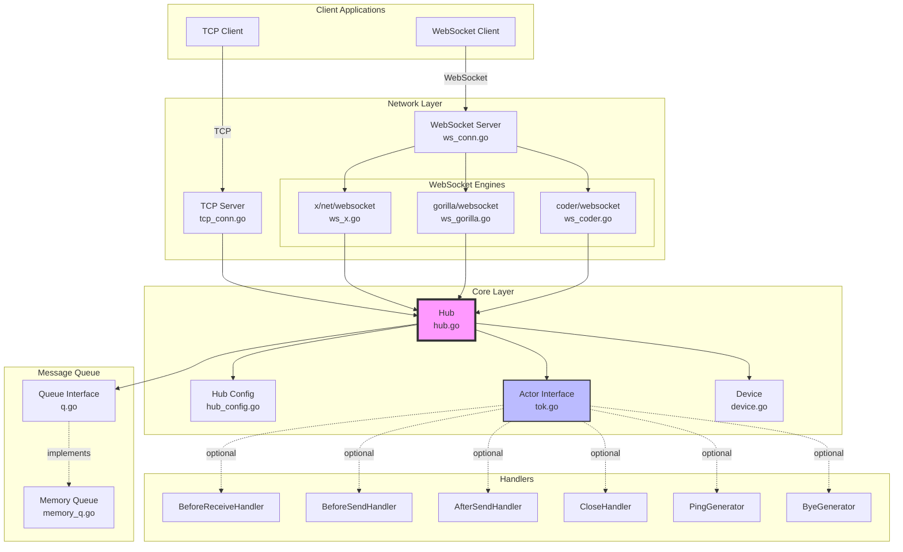

tok
===

"talk", a library to simplify creating IM application

Installation
------
    go get github.com/quexer/tok

Features
--------

- Supports both TCP and WebSocket servers for flexible IM application deployment.
- Modular design: core logic is decoupled from network adapters, making it easy to extend or customize.
- Simple API for creating hubs, managing connections, and handling messages.
- Built-in memory queue for offline message caching, with pluggable queue interface.
- Supports single sign-on (SSO) to ensure only one active connection per user.
- Configurable timeouts for authentication, server ping, and message reading/writing.
- Easy integration with custom authentication logic.
- Cluster support available via [quexer/cluster](https://github.com/quexer/cluster).

WebSocket Engine Support
-----------------------

tok supports multiple WebSocket engines for flexible integration:

- `golang.org/x/net/websocket` (default)
- `github.com/gorilla/websocket`
- `github.com/coder/websocket`

You can select the engine via configuration options. Future engines can be added easily.

Architecture
------------

Structure
---------

- `tok.go`         : Entry and core types for the library.
- `hub.go`         : Hub logic for managing connections and message dispatch.
- `hub_config.go`  : Hub configuration and options.
- `tcp_conn.go`    : TCP server and adapter implementation.
- `ws_conn.go`     : WebSocket server implementation supporting multiple engines.
- `ws_gorilla.go`  : `github.com/gorilla/websocket` adapter.
- `ws_x.go`        : `golang.org/x/net/websocket` adapter.
- `ws_coder.go`    : `github.com/coder/websocket` adapter.
- `ws_option.go`   : WebSocket engine selection and options.
- `memory_q.go`    : Built-in in-memory message queue for offline messages.
- `device.go`      : Device abstraction for user device.
- `example/`       : Example server and client implementations. [See examples](./example/)

